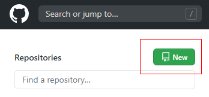
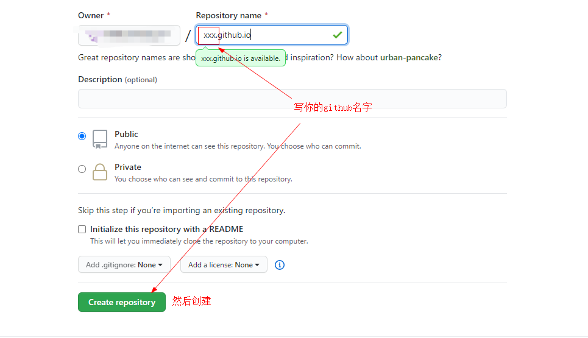
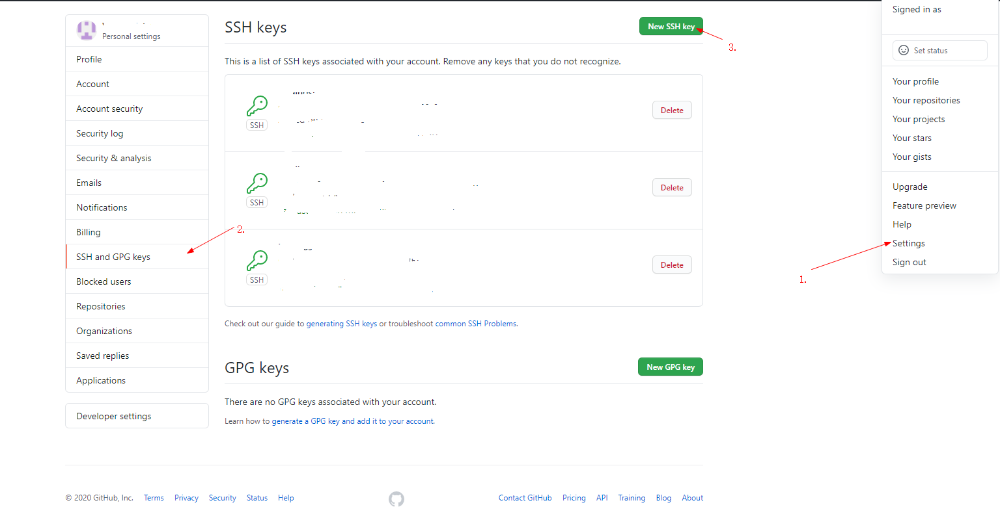

> 林深时见鹿，海蓝时见鲸

## 简介
Hexo是一款基于Node.js的静态博客框架，依赖少易于安装使用，可以方便的生成静态网页托管在GitHub和Coding上，是搭建博客的首选框架。大家可以进入[hexo官网](https://hexo.io/)官网进行详细查看，因为Hexo的创建者是台湾人，对中文的支持很友好，可以选择中文进行查看。

## 搭建步骤
1. 安装git
2. 安装node.js
3. 安装hexo
4. github创建个人仓库
5. 生成SSH key，添加到GitHub
6. 将hexo部署到GitHub

<br>

## 1. 安装git

Git是目前世界上最先进的分布式版本控制系统，可以有效、高速的处理从很小到非常大的项目版本管理。也就是用来管理你的hexo博客文章，上传到GitHub的工具。

windows：到git官网上下载,[Download git](https://gitforwindows.org/),下载后会有一个Git Bash的命令行工具，通过这个工具来使用git。

linux：执行下边代码即可安装
```js
sudo apt-get install git
```
安装成功后，可以用`git --version`查看版本

<br>

## 2. 安装node.js

hexo是基于node.js编写的，所以需要安装一下node.js和里面的npm工具。

windows：[node.js官网](https://nodejs.org/zh-cn/)，nodejs有 **LTS（长期支持版）** 和 **最新发布版** ，个人推荐选择LTS（长期支持版）。

linux：执行下边代码即可安装
```js
sudo apt-get install nodejs
sudo apt-get install npm
```
安装完后，打开命令行，输入下边代码
```js
node -v
npm -v
```
检查一下有没有安装成功

<br>

## 3. 安装hexo

安装git和node.js环境后，就可以安装hexo了。首先，需要先全局安装hexo-cli
可以通过cmd命令窗口，输入下边代码
```js
npm install -g hexo-cli
```
进行安装

也可以在本地新建一个文件夹blog，然后cd进入此文件夹，通过右键打开git bash，在窗口中输入
```js
npm install -g hexo-cli
```
进行安装

同样可以用`hexo -v`查看一下版本

至此就全部安装完了。

接下来，可以自己创建一个文件夹，在刚才创建的blog文件夹也可以，在git bash窗口中，初始化hexo
```js
hexo init myblog
```
myblog只是一个名字，取什么都行，然后
```js
cd myblog //进入这个myblog文件夹
npm install
```
新建完成后，指定文件夹目录下有：

- node_modules: 依赖包
- public：存放生成的页面
- scaffolds：生成文章的一些模板
- source：用来存放你的文章
- themes：主题
- **_config.yml: 博客的配置文件**

然后输入下边代码，
```js
hexo g
hexo s
```
这两条代码是打开hexo的服务，成功的话，在浏览器输入 localhost:4000 就可以看到你生成的博客了。
初始化的页面大概如下图：


<br>

## 4. github创建个人仓库

首先，你先要有一个github账户，如果还没有账号可以去[github官网](https://github.com/)注册一个。

注册完登录后，在github.com中看到一个`New repository` 获取 `New`，我这边是`New`这个绿色图标，点击新建


创建一个和你用户名相同的仓库，后面加.github.io，只有这样，将来要部署到github page的时候，才会被识别，也就是xxx.github.io，其中xxx就是你注册GitHub的用户名。我这里是已经建过了。


<br>

## 5. 生成SSH key，添加到GitHub

回到你的git bash中，
```js
git config --global user.name "yourname"
git config --global user.email "youremail"
```
这里的yourname输入你的github用户名，youremail输入你github的邮箱。这样github才能知道你是不是对应它的账户。完成后可以通过以下两条进行确认是否正确输入
```js
git config user.name
git config user.email
```
然后创建SSH,一路回车
```js
ssh-keygen -t rsa -C "youremail"
```
这个时候它会告诉你已经生成了.ssh的文件夹。在你的电脑中找到这个文件夹。

而后在github中点击右侧个人头像，找到setting，进入找到SSH keys的设置选项，点击左侧SSH and GPG keys，点击New SSH key新建
把你的id_rsa.pub里面的信息复制进去，然后点击Add SSH key进行SSH key的添加。


在gitbash中，查看是否成功
```js
ssh -T git@github.com
```

## 6. 将hexo部署到GitHub

这一步，我们就可以将hexo和github关联起来，也就是将hexo生成的文章部署到github上，打开站点配置文件 _config.yml，翻到最后，修改为
YourgithubName就是你的gitgub账户
```js
deploy:
  type: git
  repo: https://github.com/YourgithubName/YourgithubName.github.io.git
  branch: master
```
这个时候需要先安装deploy-git ，也就是部署的命令,这样你才能用命令部署到github。
```js
npm install hexo-deployer-git --save
```
然后
```js
hexo clean
hexo generate
hexo deploy
```
其中`hexo clean`清除了你之前生成的东西，也可以不加。
`hexo generate`顾名思义，生成静态文章，可以用`hexo g`缩写
`hexo deploy`部署文章，可以用`hexo d`缩写

注意deploy时可能要你输入username和password。

部署成功之后，过一会儿就可以在`http://yourname.github.io`这个网站看到你的博客了！！